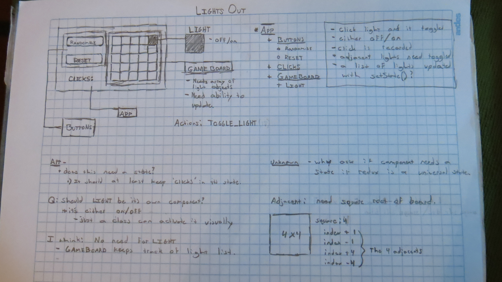

# Lights Out!
###### redux practice

The components / containers:
* App
  * Buttons
    * randomize
    * reset
  * clicks
  * GameBoard
    * Light []

##### App
* Holds all components
* displays information about GameBoard

##### GameBoard
* displays lights
* holds lights []
* action: TOGGLE_LIGHT

##### Buttons
* randomize
  * action: RANDOM_LIGHTS
  * change percentage of

## reducers

###### ToggleReducer
  * toggles current index light
  * toggle non-diagnal adjacent and index lights
    * index
    * index + 1
    * index - 1
    * index + sqrt(lights.length)
    * index - sqrt(lights.length)

###### RandomLightsReducer
  * reset and randomize entire list of lights

[planning](./events.png)
