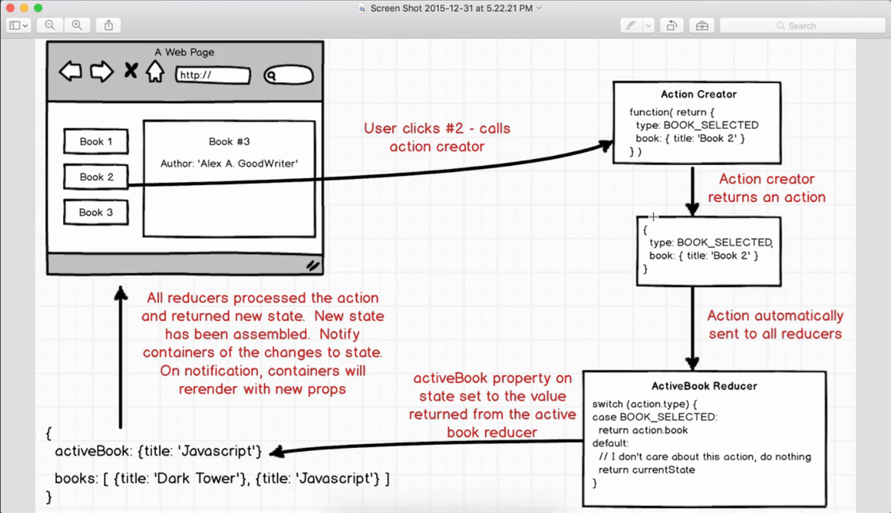

# Lights Out

### Basic Structure

##### Components
* App
  * most parent Component
* buttons.js
  * restart / randomize
* info.js
  * click count & highest score (lowest clicks)
* game_board.js
  * holds all the lights
* light.js

> Should GameBoard have a state? 
> Does Light component need a state? 

* Light is clicked
  * click count needs appended
  * Light id needs to be known by GameBoard

* GameBoard state
  * list of lights
    * id
    * on/off
  * render lights as on/off
* App
  * click count

I will go for # of clicks first

